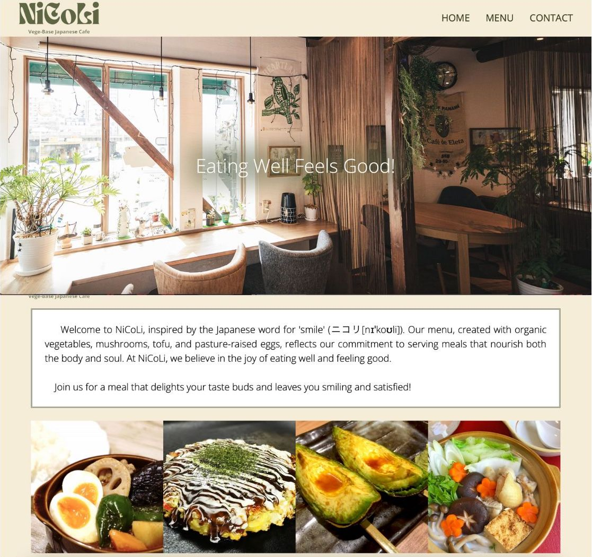

# odin-restaurant-page

## The Odin Project: Restaurant Page

  

## Summary

This project is a desktop-browser-based restaurant website built using JavaScript, CSS, and HTML. The main objectives include demonstrating knowledge of npm, JavaScript ES6 modules, and website development with webpack. 

For detailed lessons on these concepts, visit [The Odin Project - Project: Restaurant Page](https://www.theodinproject.com/lessons/node-path-javascript-restaurant-page).

## Key Project Instructions:

- The website should consist of three pages: Home, Menu, and Contact.
- Only the `<html>`, `<body>`, and `
` tags should be present in index.html.
- All content must be dynamically created using JavaScript inside a `
`, which is then appended to `
`.
- Create a module for each page, a style sheet, and an index.js as the entry point.
- The index.js should contain eventListeners that clear the content and reload the respective page upon clicking its tab.

## Skills Acquired & Applied:
This project allowed me to improve various skills and integrate previously learned concepts:

  
 Problem Solving 

- Recognizing problems
- Planning solutions
- Applying the divide and conquer strategy

  
 Error Correction 

  
- Utilizing Chrome Developer Tools
- Researching solutions online 

  
 Clean Code Writing 

  
- Maintaining consistent indentation
- Adopting descriptive naming conventions
- Adhering to principles like YAGNI, DRY, and KISS 

  
 CSS 

- 🆕 Using 'position: sticky' with the setting of calc() in sibling elements
- Implementing CSS resets
- Incorporating custom fonts
- Applying advanced styling properties
- Prioritizing the use of relative units 
- Defining and utilizing custom properties

  
 Javascript & DOM Manipulation 

- 🆕 Implementing ES6 modules 
- 🆕 Developing a webpage entirely with DOM manipulation
- Using event delegation 
- Applying ternary operators
- Creating and manipulating objects 
- Understanding various data types
- Implementing conditionals, methods, loops, and functions
- Applying `appendChild()` and `append()`
- Modifying styles and HTML content
- Building eventListeners

  
 Emmet 

- Writing HTML using abbreviations
- Applying shortcut keys for efficiency

  
 Git 

- 🆕 Using .gitignore
- 🆕 Deploying bundled website to GitHub Pages
- Managing code with branching 

  
 npm 

- 🆕 Generating the package.json file
- 🆕 Installing packages
- 🆕 Writing scripts as task runners 

  
 webpack 

- 🆕 Organizing directories for entry and output
- 🆕 Managing assets
- 🆕 Using webpack-dev-server as a development tool 

 

*** 

### Resources Used 

- google-webfonts-helper by [Mario Ranftl](https://gwfh.mranftl.com/fonts)
- UI Designing Tool by [Figma.com](https://www.figma.com)
- ColorSpace by [mycolor.space](https://mycolor.space/)
- Graphic Design Tool by [Canva.com](https://www.canva.com/)
- ChatGPT-4 by [ChatGPT](https://chat.openai.com)

- Interior Images by [PAKUTASO](https://www.pakutaso.com/)
- Food Images by [photoAC](https://www.photo-ac.com/)

### Referenced Tutorials

JavaScript Related:

- [A Comprehensive Look at ES6 Modules by JavaScript Tutorial](https://www.javascripttutorial.net/es6/es6-modules/)

- [Accessibility Meaningful & Decorative Images by W3Schools](https://www.w3schools.com/accessibility/accessibility_meaningful_images.php)

- [Must-Know Append JavaScript Explained by SoftAuthor](https://softauthor.com/javascript-append-html-string/)

CSS Related: 

- [blur() by MDN](https://developer.mozilla.org/en-US/docs/Web/CSS/filter-function/blur)

- [Before and After pseudo elements explained - part one: how they work by Kevin Powell](https://youtu.be/zGiirUiWslI?si=24Bn1mMKJ-uqSkuP)

- [CSS white-space Property by DigitalOcean](https://www.digitalocean.com/community/tutorials/css-white-space-property)

- [How to Fix Issues With CSS Position Sticky Not Working? by DESIGNCIZE](https://www.designcise.com/web/tutorial/how-to-fix-issues-with-css-position-sticky-not-working)

- [Remove All Child Nodes by JavaScript Tutorial](https://www.javascripttutorial.net/dom/manipulating/remove-all-child-nodes/)

- [JavaScript Event Delegation by JavaScript Tutorial](https://www.javascripttutorial.net/javascript-dom/javascript-event-delegation/)

Npm Related: 

- [Using webpack-dev-server by webpack](https://webpack.js.org/guides/development/#using-webpack-dev-server)

Design Related: 

- [The 20 Best Restaurant Websites of 2023 by Bentobox](https://www.getbento.com/blog/best-restaurant-websites-design/)

- [22 Restaurant Website Design Examples We Love [+ How To Make Your Own] by HubSpot](https://blog.hubspot.com/website/restaurant-website-design)